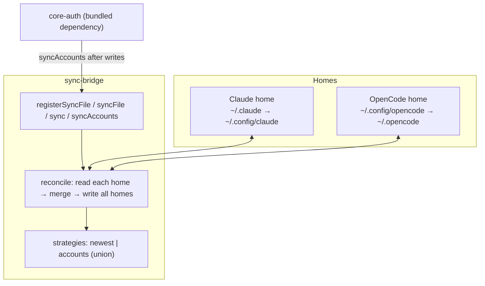

# sync-bridge

[](https://www.npmjs.com/package/sync-bridge)
[](https://www.npmjs.com/package/sync-bridge)
[](https://github.com/intisy/sync-bridge/actions/workflows/publish.yml)

Syncs config and account files between the Claude Code and OpenCode home directories. Every other plugin in the ecosystem stays inside the single home of the app it is running in; **sync-bridge is the one component permitted to span both homes**, so an account logged in (or a config changed) in one app is mirrored to the other. It is bundled into [core-auth](https://github.com/intisy/core-auth) as a built-in optional dependency, which is how a single login serves both applications.

## Under-the-Hood Architecture



Each home is resolved by precedence (Claude prefers `~/.claude`; OpenCode prefers `~/.config/opencode`), overridable via `HUB_CLAUDE_DIR` / `HUB_OPENCODE_DIR`. A relative path (e.g. `config/core-auth-accounts.json`) is read from every existing home, reconciled by a merge strategy, and written back atomically to all homes. The `accounts` strategy unions the core-auth account store by account id so no login is ever lost; `newest` copies the most-recently-modified version.

## Structure

- `src/` — TypeScript source (`homes`, `merge`, `sync`, `config`, `index`)
- `dist/` — Compiled output (generated; not committed)
- `test/` — Node test runner specs

## Installation

### Via plugin-updater (recommended)
Add to `~/.config/opencode/config/plugins.json`:
```json
[{ "name": "sync-bridge", "url": "https://github.com/intisy/sync-bridge", "enabled": true }]
```

### Via npm
```bash
npm install sync-bridge
```

## API

```ts
import { syncAccounts, syncFile, registerSyncFile, sync, existingHomes } from "sync-bridge";

syncAccounts();                                   // union the core-auth account store across homes
syncFile("config/plugins.json", { strategy: "newest" });
registerSyncFile("config/plugins.json", { strategy: "newest" });
sync();                                           // reconcile everything registered
```

## Configuration

Config file: `~/.config/opencode/config/sync-bridge.json` (preferred) or `~/.config/opencode/sync-bridge.json` (fallback); same under `~/.claude` for Claude Code.

```json
{
  "logging": true,
  "files": [{ "path": "config/plugins.json", "strategy": "newest" }]
}
```

The core-auth account store (`config/core-auth-accounts.json`) is always synced; `files` adds more.

## Logging

Logs are written to `<home>/logs/YYYY-MM-DD/sync-bridge-HH-MM-SS.log`. Set `"logging": false` to disable.

## License

MIT
